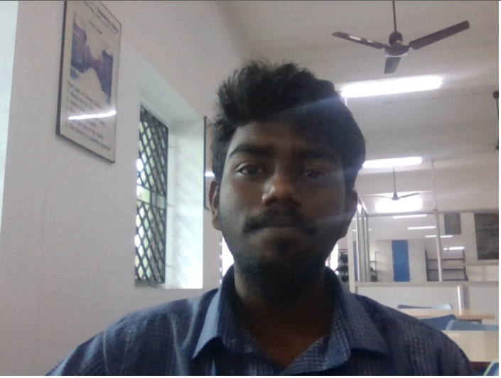
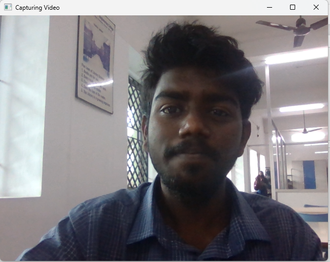
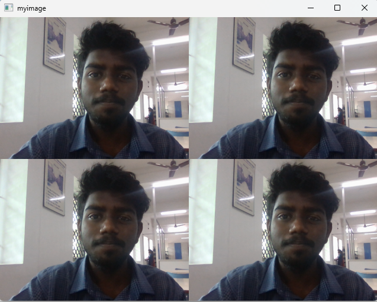
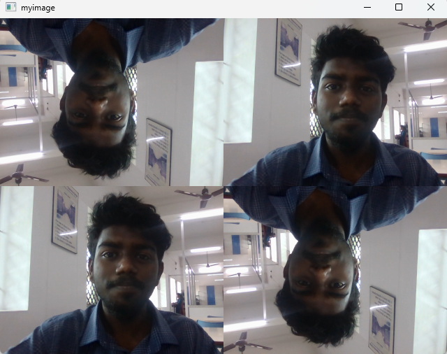

# Image-Acquisition-from-Web-Camera
## Aim
 
Aim:
 
To write a python program using OpenCV to capture the image from the web camera and do the following image manipulations.


## Software Used
Anaconda - Python 3.7
## Algorithm
### Step 1: Write the frame as JPG 
<br>

### Step 2: Display the video 
<br>

### Step 3: Display the video by resizing the window
<br>

### Step 4: Rotate and display the video
<br>

### Step 5: End the program.
<br>

## Program:
``` Python
 Developed By: P.SANDEEP
 Register No: 212221230074
```

## i) Write the frame as JPG file
```
import cv2
video = cv2.VideoCapture(0)
while (True):
    cap,frame=video.read()
    cv2.imwrite('video.jpeg',frame) 
    result = False
video.release()
cv2.destroyAllWindows()

```


## ii) Display the video
```
import cv2
video = cv2.VideoCapture(0)
while (True):
    cap,frame=video.read()
    cv2.imshow('Capturing Video',frame)
    if cv2.waitKey(1) == ord('q'):
        break
video.release()
cv2.destroyAllWindows()
```


## iii) Display the video by resizing the window
```
import cv2
import numpy as np
cap  = cv2.VideoCapture(0)
while True:
    ret,frame = cap.read()
    width = int(cap.get(3))
    height = int(cap.get(4))
    image = np.zeros(frame.shape, np.uint8)
    small_frame = cv2.resize(frame,(0,0),fx =0.5, fy = 0.5)
    image[:height//2, :width//2]=small_frame
    image[height//2:, :width//2]=small_frame
    image[:height//2, width//2:]=small_frame
    image[height//2:, width//2:]=small_frame
    cv2.imshow('myimage',image)
    if cv2.waitKey(1) == ord('q'):
        break
video.release()
cv2.destroyAllWindows()
```


## iv) Rotate and display the video
```

import cv2
import numpy as np
cap  = cv2.VideoCapture(0)
while True:
    ret,frame = cap.read()
    width = int(cap.get(3))
    height = int(cap.get(4))
    image = np.zeros(frame.shape, np.uint8)
    small_frame = cv2.resize(frame,(0,0),fx =0.5, fy = 0.5)
    image[:height//2, :width//2]=cv2.rotate(small_frame,cv2.ROTATE_180)
    image[height//2:, :width//2]=small_frame
    image[:height//2, width//2:]=small_frame
    image[height//2:, width//2:]=cv2.rotate(small_frame,cv2.ROTATE_180)
    cv2.imshow('myimage',image)
    if cv2.waitKey(1) == ord('q'):
        break
video.release()
cv2.destroyAllWindows()
```


## Output

### i) Write the frame as JPG image

</br>
</br>


### ii) Display the video

</br>
</br>


### iii) Display the video by resizing the window

</br>
</br>


### iv) Rotate and display the video

</br>
</br>


## Result:
Thus the image is accessed from webcamera and displayed using openCV.
